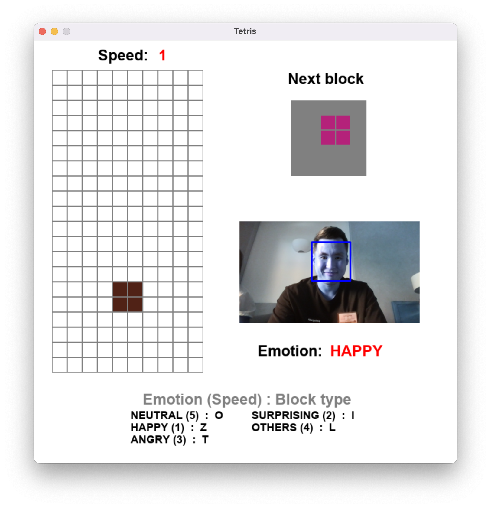

# Emo-tris 😀😳😠🤔😐
Play Tetris **Emotionally**! Use your facial expressions to play Tetris. 

Every single play, your facial expressions will be *randomly* matched with **block types**. Besides, you have to control your facial expressions to manage the **block speed**!

| Emotion   | Speed |
|-----------|-------|
| Happy     | 1     |
| Surprised | 2     |
| Angry     | 3     |
| Others    | 4     |
| Neutral   | 5     |

## Quick start
Python <= 3.7
- Windows `pip install -r requirements.txt`
- MacOS `pip install -r requirements_formac.txt`

## How to play
1. Run `main.py`
2. Read matched **Emotion : Block type** below your screen.
   1. Emotions and block types will be randomly matched.
   2. Don't worry! The emotion&speed relation is always the same. Just the block types are changing each round!
3. Be emotional to manage next block type and speed.
4. Cheer up!

### Tips for Newbies
- Be **emotional(!)** because a *neutral* face will drop your blocks really quickly.
- **Smile** while you are planning your strategy! A *happy* face will slow down the falling blocks.
